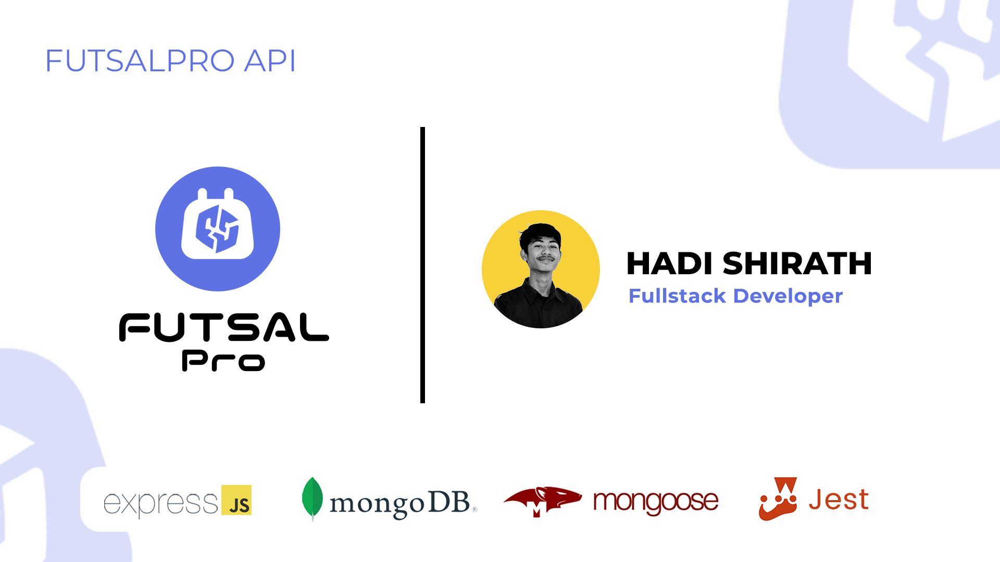

# FutsalPro API Postman Collection

[](https://documenter.getpostman.com/view/25132098/2sA2xnyAAx)

## Introduction



## Usage Instruction

1. Download and open [Postman](https://www.getpostman.com)
2. Import:

   - Use this button to download:
     [](https://documenter.getpostman.com/view/25132098/2sA2xnyAAx) , or
   - Clone or [download](../../archive/master.zip) this repository, then import postman collections from `FutsalPro API.postman_collection.json` file.

3. Add file `.env` and config `.env`
   ```
   {
   MODE=dev
   SERVICE_NAME=futsalpro
   MONGODB_URL=[INSER-MONGODB-URL]
   JWT_KEY=[INSERT-YOUR-CUSTOMIZE-JWT-KEY]
   AUTHORIZATION_MIDTRANS=Basic [INSERT-YOUR-SERVER-KEY-MIDTRANS]
   URL_MIDTRANS=https://app.sandbox.midtrans.com/snap/v1/transactions
   URL_MIDTRANS_STATUS=https://api.sandbox.midtrans.com/v2
   }
   ```
4. run `npm install` in terminal for install packages
5. Run the project using `npm run dev`

## Description API

1. Build project with Express Js.
2. Using MongoDB Database.
3. Supporting ODM (Object Document Mapper) Mongoose.
4. Authentication JWT Token.
5. Password hashing & Encryption.
6. 7 Collection folders contain a total of 29 API Endpoints.
